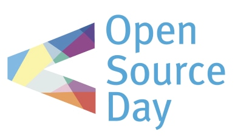

I developed and maintained a robust portfolio website for hearing company . This project combined my web development skills with a passion for knowledge sharing. The platform effectively highlights the company's work while providing a valuable resource for aspiring coders.

## A sneak peek into what we have here🙈 :

### Home Page:

### About Page:

### Project Page:

### Research Page:

### Education Page:

<!-- ## How to use this?🛠 -->

<!-- [Check out our awesome Documentation](https://smaranjitghose.github.io/awesome-portfolio-websites/)

## Contribution Guidelines🏗

Are we missing any of your favorite features, which you think you can add to it❓ We invite you to contribute to this project and improve it further.

Click on the image below to set up and contribute to the project or [Click here](https://github.com/smaranjitghose/awesome-portfolio-websites/blob/master/CONTRIBUTING.md)

 -->

<!-- ## Project Maintainers👨🏫: -->
<!-- 
|  |  | 
| :----------------------------------------------------------: | :----------------------------------------------------------: | 
|     [Smaranjit Ghose](https://github.com/smaranjitghose) |    [Anush Bhatia](https://github.com/anushbhatia)                        -->

<!-- ## Our valuable Contributors👩‍💻👨‍💻 : -->
<!-- 
 -->

<!-- ## Open Source Programs we have been a part of: -->
<!-- 

 -->
